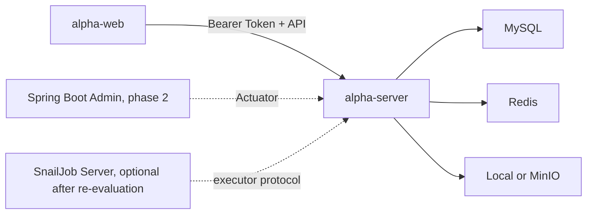
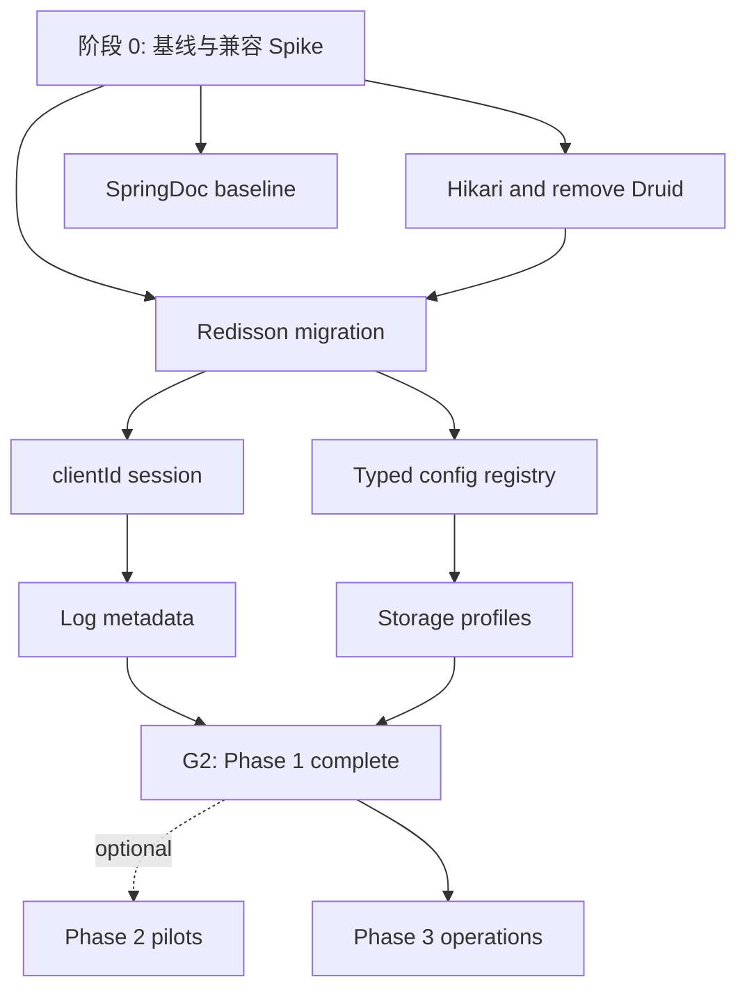

# 目标架构

## 1. 架构结论

Alpha Vue 继续采用“业务单体 + 可选运维扩展”：

- `alpha-server` 是唯一业务后端。
- `alpha-web` 是唯一后台管理前端。
- MySQL、Redis、MinIO 是运行依赖。
- Spring Boot Admin 可在二期按需作为独立运维扩展；SnailJob 仅保留长期重评入口，不属于已排期基线。
- 不因学习 RuoYi Plus 而拆分大量 Maven 模块，不因学习 Vben5 而改造成 Monorepo。

目标不是建设通用平台，而是让后续业务开发可以在明确边界内快速增加领域、页面、接口和基础设施适配。

## 2. 设计原则

按优先级执行：

1. **现有业务可用性优先**：每个阶段结束后项目必须可启动、可测试、可回退。
2. **兼容性先于依赖选择**：Spring Boot 4 最小 Spike 未通过的依赖不得进入主实现。
3. **单体优先**：只有独立故障域或独立运行价值明确时才增加进程。
4. **领域拥有状态**：Redis、缓存、配置和日志由所属领域通过端口访问，不提供万能静态工具。
5. **安全默认收紧**：敏感内容缺少策略或解析失败时必须隐藏，不得失败时返回原文。
6. **试点先于平台化**：VXE、ECharts、跨设备偏好等能力先在代表性场景验证。
7. **当前规范描述当前行为**：目标文档不能提前替换现行运维和安全事实。
8. **不为未来需求预写空实现**：保留接口和边界，不创建 OSS、多数据源、任务等空壳代码。

## 3. 物理结构

```text
alpha-vue/
├── alpha-server/                 # Spring Boot 业务单体
├── alpha-web/                    # Vue 管理端单应用
├── alpha-extensions/             # 二期以后按兼容性决策创建
│   └── monitor-admin/            # 可选 Spring Boot Admin Server
├── deploy/                       # Compose、环境示例、smoke
├── docs/                         # 当前正式规范
└── docs/requirements/            # 目标需求、架构和计划
```

一期不得为了目录完整预建空的 `alpha-extensions`。



## 4. 后端逻辑结构

```text
io.github.onedream921.alphavue/
├── common/                       # 纯契约、异常、常量、无 Spring 领域工具
├── framework/                    # 技术配置和基础设施适配
│   ├── web/
│   ├── json/
│   ├── mybatis/
│   ├── redis/
│   ├── cache/
│   ├── security/
│   ├── sensitive/
│   └── observability/
└── modules/
    ├── auth/
    ├── system/
    ├── file/
    ├── log/
    └── monitor/
```

边界：

- `common` 不依赖 `framework` 或 `modules`。
- `framework` 不依赖具体 Controller 或页面语义。
- `modules/<domain>` 可以依赖 `common` 和必要的 `framework` 端口。
- 领域间调用优先依赖明确 Service，不共享 Mapper 或 Entity。
- 目录按实际实现创建，不为目标结构提前增加空包。

不建设 `RedisUtils`、`ConfigUtils`、`SpringUtils` 等全局静态入口。成熟通用算法可以使用 Hutool Core，依赖 Spring Bean 或业务状态的能力必须是可注入服务。

## 5. 前端逻辑结构

一期保持当前单应用与 Ant Design Vue 表格：

```text
src/
├── service/                      # 按领域拆分 API，保留迁移期兼容出口
├── components/                   # 经真实复用证明的公共组件
├── composables/
├── directives/
├── layouts/
├── router/
├── stores/
├── styles/
├── utils/
└── views/                        # 按领域组织页面
```

二期先在真实页面验证查询、表格、弹窗和确认操作。只有同一种重复规则已经在至少两个
真实页面稳定出现，才允许逐个抽取公共组件并单独评审命名和契约。不得预先建设
`AlphaGrid` 等整套抽象，也不得演变为 JSON Schema 页面生成器或通用 CRUD DSL。

## 6. 阶段依赖图



不得并行执行存在数据格式依赖的任务，例如 Redisson Codec 与缓存监控改造、Sa-Token DAO 与并发会话规则。

## 7. 兼容性决策闸门

每个候选依赖必须在隔离分支或工作树完成最小 Spike：

| 候选 | 最小证明 | 失败处理 |
| --- | --- | --- |
| Redisson | Spring Boot 4 启动、连接、分层 Codec、Spring Cache、Sa-Token DAO 测试 | 不进入迁移；评估直接 Redisson Client 配置或替代版本 |
| Therapi | 编译期生成 Javadoc 元数据，SpringDoc 3 能读取 Controller/DTO 注释 | 保留 SpringDoc 最小注解，不复制 RuoYi 内部 Handler |
| Spring Boot Admin | Server/Client 与 Boot 4 Actuator 注册、认证、健康读取 | 延期或仅保留 Actuator/Prometheus |
| SnailJob | Server 与 Boot 4 Client 注册、手动执行、日志和失败重试 | 延期，不以测试任务替代兼容结论 |
| Lock4j | Boot 4 启动、Redisson Executor、并发互斥、超时和异常处理 | 出现真实锁场景时直接封装 Redisson 或寻找替代 |
| VXE Table | 与当前 Vue、Ant Design Vue、UnoCSS 共存，桌面与移动端可用 | 继续使用 Ant Table，不建设 AlphaGrid |

Spike 结果使用：

- `GO`：版本明确、最小运行和测试通过，可以进入对应阶段。
- `DEFER`：能力有价值，但当前兼容或成本不满足。
- `REPLACE`：候选不适合，记录替代方案。

### 7.1 S0-05 冻结版本矩阵

版本矩阵冻结的是已验证实施基线，不代表追逐最新版本。正式任务开始时只检查安全公告、
制品可用性和依赖树漂移；不得无证据顺手升级。

| 能力 | 当前/验证版本 | 决策 | 进入阶段 | 约束 |
| --- | --- | --- | --- | --- |
| Java / Spring Boot | Java 21 / Boot 4.0.0 | `KEEP` | 全阶段 | 不在基础设施迁移中升级 Boot |
| MyBatis-Plus | 3.5.13 | `KEEP` | 全阶段 | 保持现有数据访问边界 |
| HikariCP | Boot BOM 管理，当前解析 7.0.2 | `GO` | 一期 P1-01 | 不显式锁定池版本，删除 Druid 后验证指标 |
| Druid | 1.2.28 | `REMOVE` | 一期 P1-01 | 不保留监控入口、配置或兼容层 |
| SpringDoc | 3.0.3 | `KEEP` | 一期 P1-02 | 保留 SpringDoc，删除 Knife4j |
| Therapi | 0.15.0 | `GO WITH CONSTRAINTS` | 一期 P1-02 | Javadoc 优先，复杂契约允许最小 OpenAPI 注解 |
| Knife4j | 4.4.0 | `REMOVE` | 一期 P1-02 | 生产文档端点继续关闭 |
| Redisson | 4.6.1 | `GO WITH CONSTRAINTS` | 一期 P1-03/P1-04 | 直接 Client 配置；迁移前复查依赖树与故障路径 |
| Spring Data Redis / Lettuce | 4.0.0 / 6.8.1 | `REMOVE` | 一期 P1-03/P1-04 | 不双写；清理旧 Key 并使旧会话失效 |
| Sa-Token | 1.45.0 | `KEEP` | 一期 clientId 闭环 | 会话行为改造与版本升级分离 |
| MinIO Client | 8.5.17 | `KEEP` | 一期存储整理 | local 与 MinIO 均保留真实实现 |
| Spring Boot Admin | 4.0.4 | `GO WITH CONSTRAINTS` | 二期可选 | 独立进程；有真实运维需求才实施 |
| VXE Table / VXE PC UI | 4.20.9 / 4.16.23 | `GO WITH CONSTRAINTS` | 二期可选 | 单个复杂列表、路由异步、局部导入 |
| SnailJob | 2.0.2 | `DEFER` | 未排期 | 失败链路、重试和多实例刚需齐备后重评 |
| Lock4j | 2.2.7 | `DEFER` | 未排期 | 先用唯一约束或直接 Redisson 锁 |

p6spy、SkyWalking、动态数据源不在当前运行依赖中，也不进入目标技术栈。Node 26 与
pnpm 11 只是 Spike 执行环境；正式最低开发基线仍按现行规范执行，不由本矩阵上调。

完整证据、顺序、回滚和 G0 结论见
[S0-05 兼容性决策评审](./compatibility-decision-review-2026-07-30.md)。

## 8. 配置边界

### 部署配置

通过环境变量或部署配置提供，修改后重启：

- MySQL、Redis、MinIO 地址与凭据。
- Token、文件签名和运维组件凭据。
- Hikari、线程池、multipart 硬上限。
- 受信任代理、Actuator 暴露和网络边界。

### 运行时业务配置

通过代码注册并保存在 `sys_config`：

- 上传业务大小与类型白名单。
- 登录失败次数与锁定时间。
- 日志保留天数。
- SQL 摘要阈值和采集模式。
- 二期普通缓存展示策略。

密钥、连接信息和技术 Bean 选择不得进入 `sys_config`。

## 9. 数据与序列化边界

- 一期不迁移历史 ID，也不强制 Snowflake。
- 投产前单独决定自增或 Snowflake；若使用 Snowflake，必须先统一 HTTP ID 字符串和节点分配。
- 历史数据很少时优先受控重建，不做高风险主外键原地改写。
- Redis 迁移按只读盘点结果精确清理旧前缀
  `auth:captcha:*`、`auth:login:failure:*`、`system:config:*`、`system:dict:*`、
  `satoken:*`，并使旧会话失效；不得把新 `alpha:*` 前缀误当旧数据范围，也不得兼容
  读取旧 JDK 序列化。
- HTTP 与 Redis 使用独立 Jackson 配置；Redis 不开启不受控全局多态反序列化。
- ISO-8601 带时区时间作为目标契约，在独立 API 契约阶段迁移，不夹带在连接池或 Redis 任务中。

## 10. 安全不变量

- 后端权限是唯一授权边界。
- 前端组件白名单拒绝数据库中的未知组件标识。
- 密码、Token、Cookie、验证码、Authorization、密钥和文件内容永不进入操作日志或缓存预览。
- 请求/响应日志清理失败时不保存原文。
- IP 归属地和 User-Agent 解析失败不能影响业务。
- 只有来自受信任代理的转发头可以参与客户端 IP 计算。
- SQL 监控永不记录真实参数，也不提供 SQL 执行入口。
- Redis 监控不提供任意命令、任意写入、`FLUSHDB` 或 `FLUSHALL`。

## 11. 文档迁移策略

本目录描述目标。阶段实现完成前，以下正式规范继续描述当前代码：

- `docs/conventions.md`
- `docs/frontend-conventions.md`
- `docs/api.md`
- `docs/security.md`
- `docs/development.md`
- `docs/operations.md`

每个实施任务必须列出受影响的正式规范。只有对应行为和测试已经落地，才能把目标规则迁入正式规范并更新项目专属 Skill。

## 12. 不采用的方案

- 不一次性实现长期蓝图。
- 不直接以 RuoYi Plus 版本组合证明 Spring Boot 4 兼容。
- 不把 Spring Boot Admin 或 SnailJob 嵌入业务进程。
- 不先建空 OSS、多数据源、任务、锁实现。
- 不全量替换 Ant Table 后再验证 VXE。
- 不把完整请求/响应日志作为一期默认能力。
- 不修改 AFK 核心或生成投影作为规则源。
